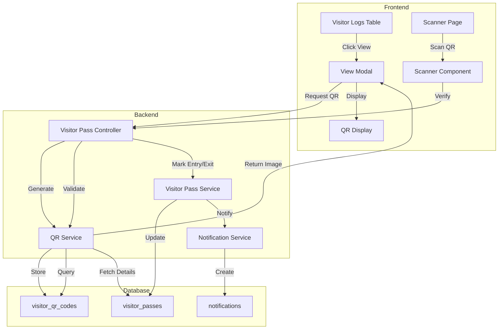

# Design Document: Visitor Pass QR View Feature

## Overview

This feature adds QR code functionality to the visitor pass management system, enabling security personnel to quickly verify visitor identity and pass details through QR code scanning. The implementation extends the existing visitor pass system with a "View" button in the visitor logs table that displays detailed pass information with a generated QR code.

The feature integrates with the existing QR service infrastructure (currently used for gatepasses) and adapts it for visitor passes. Security personnel can scan QR codes using the html5-qrcode library to verify visitor identity and mark entry/exit events.

### Key Components

- View button in visitor logs table (admin/security/coordinator views)
- Pass detail modal with QR code display
- QR code generation service for visitor passes
- Security scanner page for visitor pass verification
- Entry/Exit control flow for visitor tracking
- Notification system for security alerts

### Technology Stack

- Frontend: Next.js 14, React, Tailwind CSS, html5-qrcode
- Backend: Node.js, Express.js, qrcode library
- Database: SQLite (existing schema extension)
- Encryption: Existing encryption utilities

## Architecture

### High-Level Architecture



### Data Flow

1. View Flow:
   - User clicks "View" button in visitor logs table
   - Frontend requests visitor pass details with QR generation
   - Backend generates/retrieves QR code
   - Backend sends notification to security personnel
   - Modal displays pass details and QR code

2. Scan Flow:
   - Security opens scanner page
   - Scanner captures QR code data
   - Frontend sends encrypted data to backend for verification
   - Backend decrypts, validates, and returns pass details
   - Security marks entry or exit
   - System updates pass status and sends notifications

## Components and Interfaces

### Frontend Components

#### 1. VisitorLogs Component (Enhanced)

Location: `frontend/src/components/visitor/VisitorLogs.jsx`

Enhancements:
- Add "View" action button column to table
- Handle click event to open modal
- Pass visitor pass ID to modal component

```javascript
// New column in table
<td className="px-4 py-3">
  <button
    onClick={() => handleViewPass(log.id)}
    className="btn btn-sm btn-primary"
  >
    View
  </button>
</td>
```

#### 2. VisitorPassDetailModal Component (New)

Location: `frontend/src/components/visitor/VisitorPassDetailModal.jsx`

Props:
- `isOpen`: boolean
- `onClose`: function
- `passId`: number

State:
- `passDetails`: object | null
- `qrCode`: string | null
- `loading`: boolean
- `error`: string | null

Methods:
- `fetchPassDetails()`: Fetch pass details and generate QR code
- `downloadQRCode()`: Download QR code as PNG image
- `handleClose()`: Close modal and reset state

UI Sections:
- Visitor Information (name, phone, ID type, ID number, photo)
- Student Information (name, room number, relationship)
- Visit Details (purpose, expected exit, entry time, actual exit)
- Pass Status (status badge, pass ID)
- QR Code Display (generated QR image)
- Action Buttons (Download QR, Close)

#### 3. VisitorQRScanner Component (New)

Location: `frontend/src/components/visitor/VisitorQRScanner.jsx`

Props:
- `onScanSuccess`: function(passDetails)
- `onScanError`: function(error)

State:
- `scanning`: boolean
- `cameraError`: string | null

Methods:
- `startScanner()`: Initialize html5-qrcode scanner
- `stopScanner()`: Stop and cleanup scanner
- `handleScanSuccess(decodedText)`: Process scanned QR data
- `handleScanError(error)`: Handle scan errors

Uses: html5-qrcode library for camera access and QR decoding

#### 4. SecurityVisitorScanner Page (New)

Location: `frontend/src/app/security/visitor-scanner/page.js`

State:
- `passDetails`: object | null
- `scanning`: boolean
- `error`: string | null

Methods:
- `handleScan(qrData)`: Verify QR code with backend
- `handleMarkEntry()`: Mark visitor entry
- `handleMarkExit()`: Mark visitor exit
- `handleScanAnother()`: Reset and scan new QR

UI Sections:
- Scanner component (when scanning)
- Pass details display (after successful scan)
- Entry/Exit action buttons
- Error messages
- Scan another button

### Backend Components

#### 1. Visitor Pass Controller (Enhanced)

Location: `backend/src/controllers/visitorPassController.js`

New Methods:

```javascript
/**
 * Generate QR code for visitor pass
 * POST /api/visitor-pass/:id/qr
 */
static async generateQR(req, res, next) {
  try {
    const passId = parseInt(req.params.id);
    const qrData = await VisitorQRService.generate(passId);
    
    // Notify security
    await NotificationService.notifySecurityVisitorView(passId);
    
    res.json({
      success: true,
      data: qrData
    });
  } catch (error) {
    next(error);
  }
}

/**
 * Verify visitor pass QR code
 * POST /api/visitor-pass/qr/verify
 */
static verifyQR(req, res, next) {
  try {
    const { qrData } = req.body;
    const pass = VisitorQRService.verify(qrData, req.user.id);
    
    res.json({
      success: true,
      data: { pass }
    });
  } catch (error) {
    next(error);
  }
}
```

#### 2. Visitor QR Service (New)

Location: `backend/src/services/visitorQRService.js`

Methods:

```javascript
class VisitorQRService {
  /**
   * Generate QR code for visitor pass
   * @param {number} passId - Visitor pass ID
   * @returns {Promise<Object>} QR code data
   */
  static async generate(passId) {
    // Check if pass exists
    // Check if QR already exists and is valid
    // Create payload with pass_id, visitor_name, student_id
    // Encrypt payload
    // Generate hash
    // Store in visitor_qr_codes table
    // Generate QR image using qrcode library
    // Return QR image and metadata
  }

  /**
   * Verify visitor pass QR code
   * @param {string} qrData - Encrypted QR data
   * @param {number} securityId - Security user ID
   * @returns {Object} Visitor pass details
   */
  static verify(qrData, securityId) {
    // Decrypt QR data
    // Verify hash
    // Check expiry
    // Validate pass status
    // Return pass details
  }
}
```

#### 3. Visitor Pass Model (Enhanced)

Location: `backend/src/models/visitorPassModel.js`

New Methods:

```javascript
/**
 * Update pass status to active (entry)
 */
static markEntry(id) {
  return db.prepare(`
    UPDATE visitor_passes 
    SET status = 'active', entry_time = CURRENT_TIMESTAMP, updated_at = CURRENT_TIMESTAMP 
    WHERE id = ?
  `).run(id);
}

/**
 * Update pass status to exited
 */
static markExit(id) {
  return db.prepare(`
    UPDATE visitor_passes 
    SET status = 'exited', actual_exit_time = CURRENT_TIMESTAMP, updated_at = CURRENT_TIMESTAMP 
    WHERE id = ?
  `).run(id);
}
```

#### 4. Visitor QR Model (New)

Location: `backend/src/models/visitorQRModel.js`

Methods:

```javascript
class VisitorQRModel {
  static create(qrData) {
    // Insert into visitor_qr_codes table
  }

  static findByPassId(passId) {
    // Find QR by visitor pass ID
  }

  static findByHash(hash) {
    // Find QR by hash for verification
  }

  static markAsUsed(id) {
    // Mark QR as used (optional tracking)
  }

  static isValid(passId) {
    // Check if QR is valid and not expired
  }
}
```

### API Endpoints

#### 1. Generate QR Code

```
POST /api/visitor-pass/:id/qr
```

Authentication: Required (admin, security, coordinator)

Request Parameters:
- `id`: Visitor pass ID (path parameter)

Response:
```json
{
  "success": true,
  "data": {
    "qrCode": "data:image/png;base64,...",
    "qr_data": "encrypted_string",
    "expires_at": "2024-01-15T18:00:00Z"
  }
}
```

Error Responses:
- 404: Visitor pass not found
- 400: Pass status not approved
- 401: Unauthorized
- 500: Server error

#### 2. Verify QR Code

```
POST /api/visitor-pass/qr/verify
```

Authentication: Required (security)

Request Body:
```json
{
  "qrData": "encrypted_string"
}
```

Response:
```json
{
  "success": true,
  "data": {
    "pass": {
      "id": 123,
      "pass_id": "VP-20240115-001",
      "visitor_name": "John Doe",
      "visitor_phone": "+1234567890",
      "visitor_id_type": "passport",
      "visitor_id_number": "AB123456",
      "relationship": "Parent",
      "purpose": "Family visit",
      "student_id": 45,
      "student_name": "Jane Smith",
      "room_number": "A-201",
      "entry_time": "2024-01-15T10:00:00Z",
      "expected_exit_time": "2024-01-15T18:00:00Z",
      "actual_exit_time": null,
      "status": "approved",
      "visitor_photo_url": "https://..."
    }
  }
}
```

Error Responses:
- 400: Invalid QR code, QR code expired, Pass not approved
- 401: Unauthorized
- 404: Visitor pass not found
- 500: Server error

#### 3. Mark Visitor Entry

```
POST /api/visitor-pass/entry
```

Authentication: Required (security)

Request Body:
```json
{
  "pass_id": "VP-20240115-001"
}
```

Response:
```json
{
  "success": true,
  "message": "Visitor entry recorded",
  "data": {
    "pass": { /* updated pass details */ }
  }
}
```

#### 4. Mark Visitor Exit

```
POST /api/visitor-pass/exit
```

Authentication: Required (security)

Request Body:
```json
{
  "pass_id": "VP-20240115-001"
}
```

Response:
```json
{
  "success": true,
  "message": "Visitor exit recorded",
  "data": {
    "pass": { /* updated pass details */ }
  }
}
```

## Data Models

### Database Schema Updates

#### New Table: visitor_qr_codes

```sql
CREATE TABLE IF NOT EXISTS visitor_qr_codes (
    id INTEGER PRIMARY KEY AUTOINCREMENT,
    visitor_pass_id INTEGER UNIQUE NOT NULL,
    qr_data TEXT NOT NULL,
    qr_hash VARCHAR(255) NOT NULL,
    is_used BOOLEAN DEFAULT 0,
    used_at DATETIME,
    expires_at DATETIME NOT NULL,
    created_at DATETIME DEFAULT CURRENT_TIMESTAMP,
    FOREIGN KEY (visitor_pass_id) REFERENCES visitor_passes(id) ON DELETE CASCADE
);

CREATE INDEX IF NOT EXISTS idx_visitor_qr_codes_pass ON visitor_qr_codes(visitor_pass_id);
CREATE INDEX IF NOT EXISTS idx_visitor_qr_codes_hash ON visitor_qr_codes(qr_hash);
```

### QR Code Payload Structure

```javascript
{
  pass_id: "VP-20240115-001",
  visitor_name: "John Doe",
  student_id: 45,
  timestamp: "2024-01-15T10:00:00Z"
}
```

This payload is:
1. JSON stringified
2. Encrypted using existing encryption utilities
3. Hashed for verification
4. Encoded into QR code image

## Correctness Properties

*A property is a characteristic or behavior that should hold true across all valid executions of a system-essentially, a formal statement about what the system should do. Properties serve as the bridge between human-readable specifications and machine-verifiable correctness guarantees.*

Before defining the correctness properties, I need to analyze the acceptance criteria from the requirements document to determine which are testable as properties, examples, or edge cases.


### Property Reflection

After analyzing all acceptance criteria, I've identified the following redundancies and consolidation opportunities:

1. Properties 2.1, 2.2, 2.3, 2.4 all test that specific fields are displayed in the modal. These can be combined into a single comprehensive property: "Modal displays all required visitor pass fields"

2. Properties 4.1, 4.2, 4.3, 4.4 all test notification creation and content. These can be combined into: "QR generation creates complete notifications for all security personnel"

3. Properties 5.1 and 5.5 both test successful QR verification. These can be combined into a round-trip property: "QR generation and verification round-trip preserves pass details"

4. Properties 6.3 and 6.4 test API response structure, which is already covered by the underlying service properties (3.1, 5.5). These are redundant with service-level tests.

5. Properties 1.1 and 1.2 can be combined: "View button appears for all visitor passes regardless of status"

After consolidation, we have the following unique properties:

### Correctness Properties

### Property 1: View Button Presence

*For any* visitor pass with any status (pending, approved, rejected, active, exited, overdue), the visitor logs table SHALL display a "View" action button for that pass.

**Validates: Requirements 1.1, 1.2**

### Property 2: View Button Opens Modal

*For any* visitor pass, when the View button is clicked, the system SHALL open the Pass_Detail_Modal with the correct pass ID.

**Validates: Requirements 1.3**

### Property 3: Role-Based View Access

*For any* user with role admin, security, or coordinator, the View button SHALL be accessible and functional.

**Validates: Requirements 1.4**

### Property 4: Modal Displays Complete Pass Information

*For any* visitor pass, when the Pass_Detail_Modal opens, the modal SHALL display all required fields: visitor name, phone number, ID type, ID number, student name, room number, relationship, purpose, expected exit time, entry time, actual exit time, status, and pass ID.

**Validates: Requirements 2.1, 2.2, 2.3, 2.4**

### Property 5: Conditional Photo Display

*For any* visitor pass with a visitor_photo_url, the Pass_Detail_Modal SHALL display the visitor photo; for passes without a photo, no photo SHALL be displayed.

**Validates: Requirements 2.5**

### Property 6: Modal Close Functionality

*For any* open Pass_Detail_Modal, clicking the close button SHALL dismiss the modal and reset the modal state.

**Validates: Requirements 2.6**

### Property 7: QR Code Generation Trigger

*For any* visitor pass, when the Pass_Detail_Modal opens, the system SHALL trigger QR code generation for that pass.

**Validates: Requirements 3.1**

### Property 8: QR Payload Structure

*For any* generated QR code, when decrypted, the payload SHALL contain pass_id, visitor_name, student_id, and timestamp fields.

**Validates: Requirements 3.2**

### Property 9: QR Code Persistence

*For any* generated QR code, the system SHALL store the QR data and hash in the visitor_qr_codes table.

**Validates: Requirements 3.3**

### Property 10: QR Code Display

*For any* visitor pass with a generated QR code, the Pass_Detail_Modal SHALL display the QR code image.

**Validates: Requirements 3.4**

### Property 11: QR Expiry Matches Pass Expiry

*For any* generated QR code, the QR expiry time SHALL equal the visitor pass expected_exit_time.

**Validates: Requirements 3.5**

### Property 12: QR Code Caching

*For any* visitor pass with an existing valid QR code, requesting QR generation again SHALL return the same QR code without creating a new one.

**Validates: Requirements 3.6**

### Property 13: Expired QR Regeneration

*For any* visitor pass with an expired QR code, requesting QR generation SHALL create a new QR code with updated timestamp and expiry.

**Validates: Requirements 3.7**

### Property 14: Security Notification on QR View

*For any* QR code generation event, the system SHALL create notifications for all users with role "security" containing visitor name, student name, room number, pass ID, type "info", and title "Visitor Pass Viewed".

**Validates: Requirements 4.1, 4.2, 4.3, 4.4**

### Property 15: QR Verification Round-Trip

*For any* generated QR code, when the encrypted QR data is passed to the verify function, the system SHALL decrypt the data and return the complete visitor pass details matching the original pass.

**Validates: Requirements 5.1, 5.2, 5.5**

### Property 16: QR Verification Status Validation

*For any* visitor pass with status "approved", "active", or "exited", QR verification SHALL succeed; for passes with status "pending" or "rejected", QR verification SHALL fail with error "Visitor pass is not approved".

**Validates: Requirements 5.6, 5.7**

### Property 17: Generate Endpoint Response Structure

*For any* valid visitor pass ID, calling POST /api/visitor-pass/